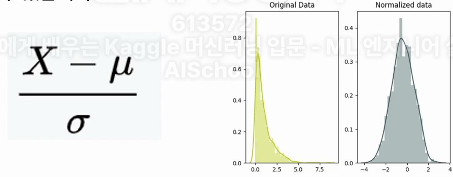

# Feature Engineering
- 유의미한 특징(Feature)들만을 선별해내거나 Feature 형태를 더욱 적합한 형태로 변경하는것을 말함
- 예측값과 전혀 연관이 없는 불필요한 특징을 제거하여 머신러닝 모델의 성능을 더욱 높이는 기법
- 예시
    ```
    동물에 관한 머신러닝 모델을 작성할 때 동물의 종, 동물의 몸무게, 동물주인의 키, 동물주인의 성별 에서 동물 주인에 관한 데이터는 필요 없으니 제거
    ```

## 1. Feature Selection


## 2. Feature Normalization
- 특징(Feature)값의 범위를 조정하는 Feature Engineering 기법

- 정규화 
    - 분포의 모양을 정규분포 형태로 변경
    - 예시
        

- MinMaxScaler
    - 범위값을 0~1 사이로 범위 변경

```python
from sklearn import preprocessing

# StandardScaker 
nor_data = preprocessing.StandardScaler().fit_transform(data)


# MinMaxScaler
nor_data_2 = preprocessing.MinMaxScaler().fit_transform(data)
```


## 3. Feature Generation
- 기존 특징을 조합해서 새로운 기법을 만들어냄
