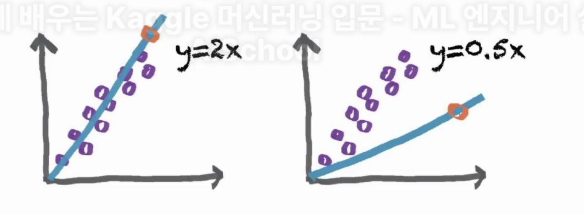

# 선형회귀(Linear Regression)

## 1. 분류 문제 vs 회귀 문제
- 이때 예측 모델값의 형태에 따라서 분류 문제 혹은 회귀 문제로 나뉩니다
- 분류 문제 : 예측하는 결과값이 이산인 문제
    - 이 이미지에 해당하는 숫자는 1인가 2인가?
- 회귀 문제 : 예측하는 결과값이 연속값인 문제
    - 3개월 뒤 이 아파트 가격은 2억 1천만 원일 것인가? 2억 2천만원일 것인가

## 2. 선형회귀(Liner Regression)
- 선형 회귀 모델은 아래와 같은 선형 함수를 이용해서 회귀를 수행하는 모델을 뜻합니다
    - y = Wx + b
- 이 때 x,y는 우리가 갖고 있는 데이터고, W,b는 데이터에 적합한 값으로 학습될 수 있는 파라미터

    