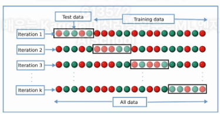

# 선형회귀(Linear Regression)

## 1. 분류 문제 vs 회귀 문제
- 이때 예측 모델값의 형태에 따라서 분류 문제 혹은 회귀 문제로 나뉩니다
- 분류 문제 : 예측하는 결과값이 이산인 문제
    - 이 이미지에 해당하는 숫자는 1인가 2인가?
- 회귀 문제 : 예측하는 결과값이 연속값인 문제
    - 3개월 뒤 이 아파트 가격은 2억 1천만 원일 것인가? 2억 2천만원일 것인가

## 2. 선형회귀(Liner Regression)
- 선형 회귀 모델은 아래와 같은 선형 함수를 이용해서 회귀를 수행하는 모델을 뜻합니다
    - y = Wx + b
- 이 때 x,y는 우리가 갖고 있는 데이터고, W,b는 데이터에 적합한 값으로 학습될 수 있는 파라미터

    
- 위 사진에서 보라색 동그라미는 트레이닝 데이터, 파란색 라인은 선형 회귀 기법이 학습한 가설, 주항 동그라미는 학습한 가설을 바탕으로 테스트 데이터에 대해 예측을 수행한 결과
- 왼쪽 그림은 선형 회귀 모델이 y=2x(W=2, b=0)가설
- 오른쪽 글미은 선형 회귀 모델이 y=0.5x(W=0.5, b=0) 가설
- 잘못된 선형 함수가 학습된 경우 오른쪽 그림과 같이 나타남


## 3. Regression 알고리즘 성능 평가 지표 - MSE(Mean Squared Error)
- 학습된 예측 모델의 성능을 평가할 수 있어야 한다
- Regression 예측모델의 성능평가는 여러가지 형태로 정의된다
    - 평균 제곱오차(MSE)가 대표적
- 테스트 데이터에 대한 MSE가 작은 머신러닝 모델이 더 좋은 머신러닝 모델
- Root를 씌운 RMSE랑 절대값을 씌운 MAE도 있다

## 4. K-Fold 교차 검증
- 데이터 개수가 너무 적을경우 트레이닝데이터, 테스트데이터가 어떻게 나눠지는가에 따라 학습 모델 성능 측정결과가 크게 나눠질 수 있음
- 예시
    ```
    키가 185, 187, 190, 154, 156 의 데이터를 가지고 
    트레이닝 데이터를 185, 187, 190로 학습하고 테스트 데이터를 154, 156 로 하면 측정결과가 크게 달라짐
    ```
    
    
- scikit-learn 사용법
    ```python
    from sklean.model_selection import KFold

    x = np.array([[1,2], [3,4], [1,2], [3,4]])
    y = np.arrya([1,2,3,4])

    kf = KFold(n_splits=2) # 2개로 나눔
    ```
    


## 5. Feature Engineering
- 유의미한 특징(Feature)들만을 선별해내거나 Feature 형태를 더욱 적합한 형태로 변경하는것을 말함
- 예측값과 전혀 연관이 없는 불필요한 특징을 제거하여 머신러닝 모델의 성능을 더욱 높이는 기법
- 예시
    ```
    동물에 관한 머신러닝 모델을 작성할 때 동물의 종, 동물의 몸무게, 동물주인의 키, 동물주인의 성별 에서 동물 주인에 관한 데이터는 필요 없으니 제거
    ```