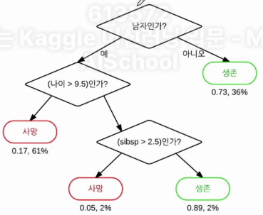

# 결정트리(Decision Tree)
- 몇몇 입력 변수를 바탕으로 목표 변수의 값을 예측하는 모델을 생성
    

## 1. 장점과 단점
- 장점
    - 알고리즘의 동작과정이 직관적
    - 학습 시간이 빠름
    - 개별 Feature들을 개별적으로 판단하므로 Feature Normalization 이 필요 X
    - Feature Normalization은 ML 성능을 좋게하기 위해 다양한 시도를 하는 기법
- 단점
    - 오버피팅에 빠지기 쉬움
    - 오버피팅이란 트리가 깊어지면서 조건이 많아져서 테스트 데이터에 대해 정확도가 낮아지는 현상
    
## 2. scikit-learn에서 사용법
- sklearn.tree.DecisionTreeClassifier : 분류 문제에서 사용
- sklearn.tree.DecisionTreeRegressor : 회귀 문제에서 사용


## 3. 결정트리를 이용해 타이타닉 생존자 예측하기
- 알아야 할 것
    ```
    1. Categorical column : 범주형 데이터는 값이 [1,2,3],["내부", "외부"]와 같이 몇 가지 분류로 한정되는 데이터
    2. Numerical Column : 숫자 축으로 무한히 위치할 수 있는 데이터 
    3. LabelEncoder : 머신러닝 알고리즘은 string 형태의 값은 처리 할 수 없기때문에 이를 숫자형 값으로 변경해주어야 함
        - scikit-learn에서 제공하는 preprocessing.LabelEncoder 클래스를 이용하여 string 형태의 값을 숫자형 값으로 변경할 수 있음  
    ```