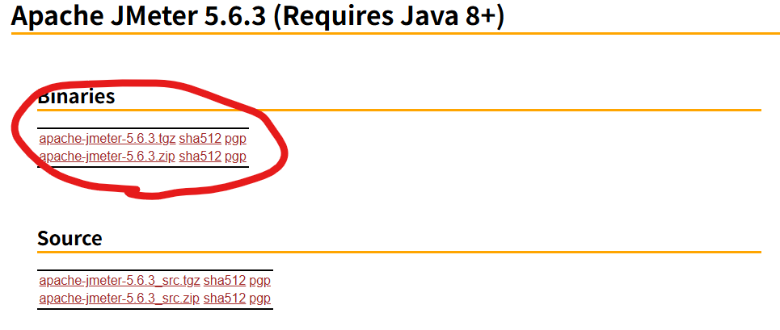
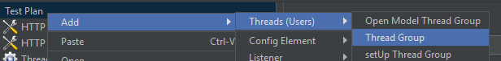
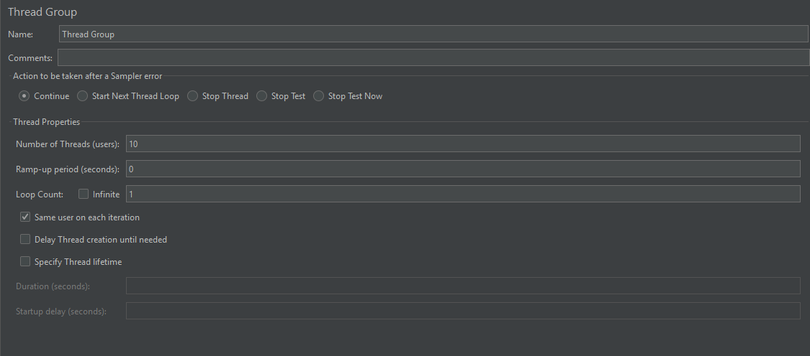
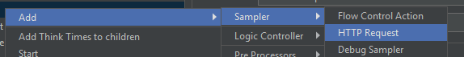
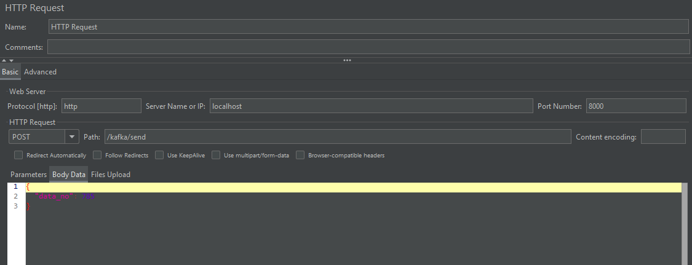
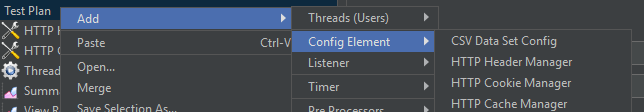
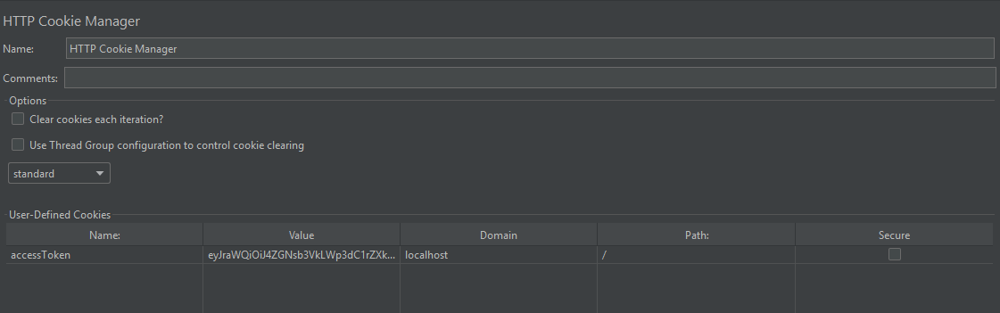
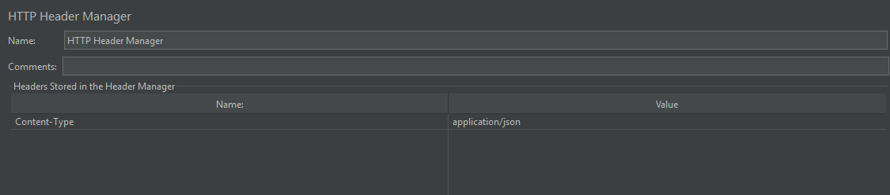
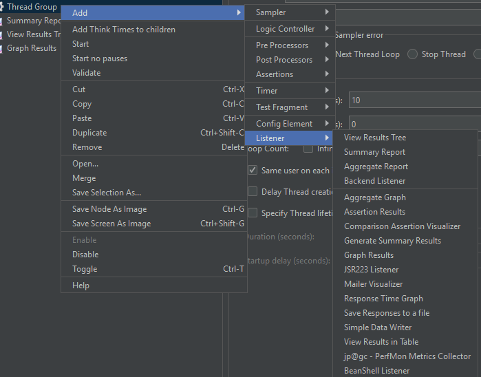
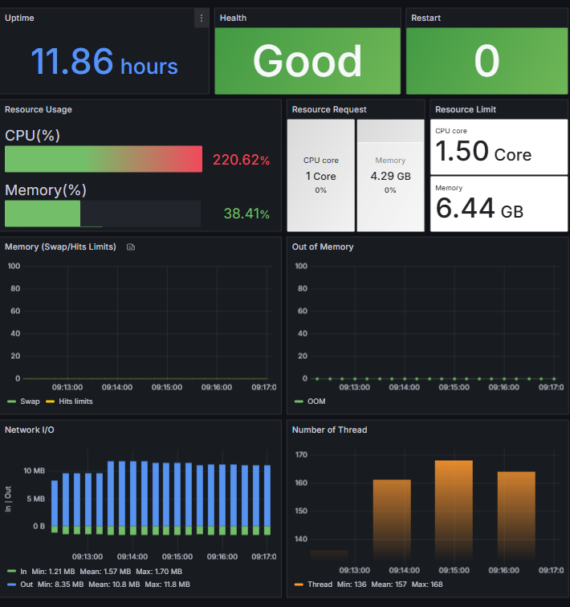

# 1. jmeter설치
- https://jmeter.apache.org/download_jmeter.cgi 

# 2. 간단 테스트
- Test Plan -> Add -> Threads -> Thread Group

    
    
    
    
    - 동시접속자, 사용자 등을 테스트하기 위한거임

- Thread Group -> Add -> Sampler -> HTTP Request

    

    

    - 테스트 요청 API 설정

- Test Plan -> Add -> Config Element -> HTTP () Manager

    

    

    

    - 위 테스트 요청 API에 필요한 헤더, 쿠키 값 등을 설정

- Thread Group -> Add -> Listener -> 각종 결과값

    
    - 테스트 결과를 보여주는 화면
    - 주로 Summary Report를 자주 봄

# 3. 시나리오 기반 테스트
- Chrome 확장자 BlazeMeter 추가

    
    - 시나리오를 녹화 해주는 역할

- BlazeMeter 설정

    

    
    - 잘 몰라서 이것저것 눌러보면서 함
    - 사진대로 하면 될듯

- 녹화 시작

    

- 녹화 불러오기

    
    - 저장된 시나리오를 Jmeter에서 불러오기

- 쿠키 설정

    
    - 쿠키나 헤더등은 녹화가 되지 않아 직접 설정해야함

- 동시접속자 세팅
    
    

- Jmeter 시작

    

- 결과

    
    - grafana 결과로 CPU가 튀는 모습을 볼 수 있다