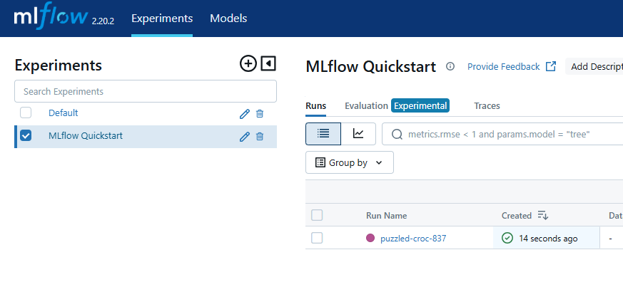

# MLflow 튜토리얼
- https://mlflow.org/docs/latest/docker.html
- 위 링크 참고하여 작성 

## 1. MLflow 실행
```yml
```

## 2. 튜토리얼 파이썬
```python
# https://mlflow.org/docs/latest/getting-started/intro-quickstart/index.html
import mlflow
from mlflow.models import infer_signature

import os
import pandas as pd
from sklearn import datasets
from sklearn.model_selection import train_test_split
from sklearn.linear_model import LogisticRegression
from sklearn.metrics import accuracy_score, precision_score, recall_score, f1_score


# Load the Iris dataset
X, y = datasets.load_iris(return_X_y=True)

# Split the data into training and test sets
X_train, X_test, y_train, y_test = train_test_split(
    X, y, test_size=0.2, random_state=42
)

# Define the model hyperparameters
params = {
    "solver": "lbfgs",
    "max_iter": 1000,
    "multi_class": "auto",
    "random_state": 8888,
}

# Train the model
lr = LogisticRegression(**params)
lr.fit(X_train, y_train)

# Predict on the test set
y_pred = lr.predict(X_test)

# Calculate metrics
accuracy = accuracy_score(y_test, y_pred)

# Set our tracking server uri for logging
mlflow.set_tracking_uri(uri=os.getenv("MLFLOW_TRACKING_URI", ""))

# Create a new MLflow Experiment
mlflow.set_experiment("MLflow Quickstart")

# Start an MLflow run
with mlflow.start_run():
    # Log the hyperparameters
    mlflow.log_params(params)

    # Log the loss metric
    mlflow.log_metric("accuracy", float(accuracy))

    # Set a tag that we can use to remind ourselves what this run was for
    mlflow.set_tag("Training Info", "Basic LR model for iris data")

    # Infer the model signature
    signature = infer_signature(X_train, lr.predict(X_train))

    # Log the model
    model_info = mlflow.sklearn.log_model(
        sk_model=lr,
        artifact_path="iris_model",
        signature=signature,
        input_example=X_train,
        registered_model_name="tracking-quickstart",
    )

    # Load the model back for predictions as a generic Python Function model
    loaded_model = mlflow.pyfunc.load_model(model_info.model_uri)

    predictions = loaded_model.predict(X_test)

    iris_feature_names = datasets.load_iris().feature_names

    result = pd.DataFrame(X_test, columns=iris_feature_names)
    result["actual_class"] = y_test
    result["predicted_class"] = predictions

    print(result[:4])

```

## 3. 실행
```bash
$ docker exec -it a9624f32765f /bin/bash

$ cd /mlflow/mlruns/
$ python tutorial.py
```

## 4. 결과

