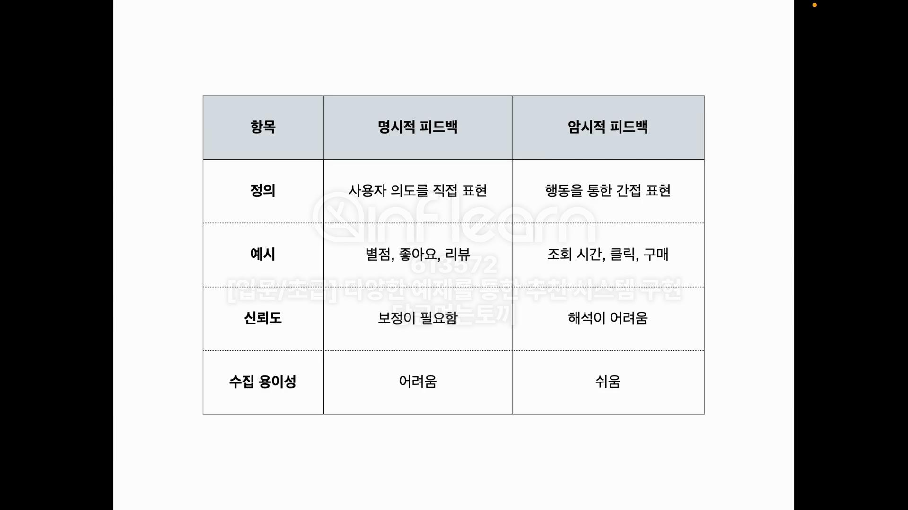

# 추천 시스템
- 추천 시스템은 사용자의 선호도나 행동을 기반으로 개인화된 콘텐츠를 제공하는 기술

## 1. 비개인화 추천 시스템
- Knowledge Base Filtering
- Content Based Filtering
  - 사용자의 과거 행동이나 선호도를 기반으로 유사한 아이템을 추천
  - 예: 영화 추천 시스템에서 사용자가 좋아했던 영화와 유사한 영화를 추천