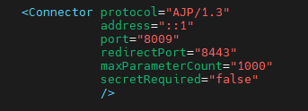
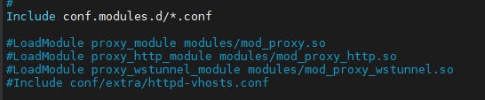

# Apache Tomcat 연동 이유?
- 정적 데이터는 웹서버인 Apache가 처리
- 동적 데이터는 WAS인 Tomcat이 처리
- 이렇게 서버의 부하를 분산하고 속도를 빠르게 하기 위해 연동하여 사용
- HTML, CSS, JavaScript같은 정적 콘텐츠들은 WAS까지 거칠 필요가 없으므로 웹서버인 Apache로 바로 응답 하는것이 빠르다.
- 연동 방법엔 mod_proxy, mod_jk, mod_proxy_ajp 3가지 방법이 있다.

## 1. mod_proxy
1. ### httpd.conf 수정
    - apahce가 설치된 곳으로 이동한다.
        ```
        # cd /etc/httpd/conf

        # vi httpd.conf
        ```

    - 이후 아래 주석을 제거 후 Include로 extra의 httpd-vhosts.conf를 로드하게 해준다.
    

2. ### httpd-vhosts.conf 작성

    - /etc/httpd/conf에 extra 디렉토리를 생성해준다.
        ```
        # mkdir extra
        ```

    - 이후 httpd-vhosts.conf를 작성한다.
    
        

3. ### CentOS SELinux 정책 수정

    - CentOS에선 SELinux 정책이 httpd가 네트워크에 연결되는 것을 막는데 SELinux 정책을 수정해야 한다.
        ```
        # sudo /usr/sbin/setsebool -P httpd_can_network_connect 1
        ```


## 2. mod_jk
1. ### Tomcat Connector 설치
    - Tomcat Connector를 설치 후 압축 해제한다.
        ```
        # wget http://apache.mirror.cdnetworks.com/tomcat/tomcat-connectors/jk/tomcat-connectors-1.2.49-src.tar.gz

        # tar zxvf tomcat-connectors-1.2.49-src.tar.gz
        ```

2. ### mod_jk 설치
    - 설치한 tomcat-connector 파일의 native 폴더에 들어가 mod_jk를 설치한다.
        ```
        # cd tomcat-connectors-1.2.49-src/native

        # sudo yum install gcc gcc-c++

        # ./configure --with-apxs=/usr/sbin/apxs

        # make

        # sudo make install
        ```

3. ### workers.properties 작성
    - [아파치경로]/conf에서 workers.properties 작성
        ```
        # cd /[아파치경로]/conf

        # vi workers.properties
        ```

    - workers.properties 작성
        ```
        worker.list=worker1

        worker.worker1.type=ajp13
        worker.worker1.host=localhost
        worker.worker1.port=8009
        ```

4. ### 10-mod_jk.conf 작성
    - [아파치경로]/conf.module.d의 10-mod_jk.conf 작성(변경)
        ```
        # cd /[아파치경로]/conf.module.d

        # vi 10-mod_jk.conf
        ```

    - 10-mod_jk.conf 작성
        ```
        LoadModule jk_module modules/mod_jk.so
        <IfModule jk_module>
            JkWorkersFile conf/workers.properties
            JkLogFile logs/mod_jk.log
            JkShmFile logs/mod_jk.shm
        </IfModule>
        ```

5. ### httpd-vhosts.conf 작성
    - [아파치경로]/conf.d에서 httpd-vhosts.conf 작성
    - mod_proxy를 할땐 extra 폴더를 만들어 거기에 적용했지만 conf.d에 넣어도 된다.
        ```
        # cd /[아파치경로]/conf.d

        # vi httpd-vhost.conf
        ```

    - httpd-vhosts.conf 작성
        ```
        <VirtualHost *:80>
            ServerName 127.0.0.1

            DocumentRoot "/home/tomcat-test/webapps/ROOT"

            #ProxyRequests Off
            #ProxyPreserveHost On

            #<Proxy *>
            #       Order deny,allow
            #       Allow from all
            #</Proxy>

            #ProxyPass "/" "http://127.0.0.1:8080/" retry=0
            #ProxyPassReverse "/" "http://127.0.0.1:8080/"

            JkMount /* worker1
        </VirtualHost>
        ```
        - mod_proxy 부분은 주석처리함

6. ### tomcat server.xml 수정
    - [tomcat경로]/conf의 server.xml 수정
        ```
        # cd /[tomcat경로]/conf

        # vi server.xml
        ```
        

7. ### httpd.conf 부분 주석
    - mod_proxy에서 작성한 부분은 주석처리 해준다.
    
        

## 3. mod_proxy_ajp
1. 
