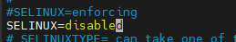

# Apache란?
- 하나의 웹서버 소프트웨어
- HTTP 웹서버
- 대부분의 운영체제에서 사용할 수 있으며 구축이 쉽다

웹서버란?
---
- 클라이언트로부터의 요청(HTTP)을 받고, 문서(HTML)나 웹 페이지를 반환해주는 컴퓨터 프로그램
- 간단히 말해 웹 페이지(HTML, CSS, JavaScript)를 클라이언트에 전달한다.
- 정적방식과 동정방식 두가지가 있다.

## 1. Apache 설치
1. ### Apache 설치
    ```
    yum -y install httpd
    ```
2. ### HTTP 방화벽 포트 80 열기
    ```
    firewall-cmd --zone=public --permanent --add-service=http

    firewall-cmd --reload
    ```

## 2. Apache 실행
1. ### SELinux 보안 정책 설정 
    ```
    # cd /etc/selinux

    # vi config
    ```

    

    - selinux에 대한 보안 정책을 종료한다.

2. ### 재부팅 후 실행
    ```
    # reboot

    # systemctl start httpd
    ```


