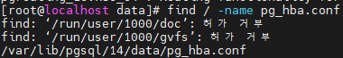
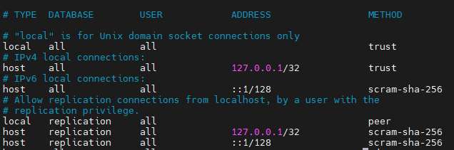
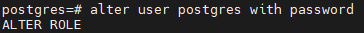
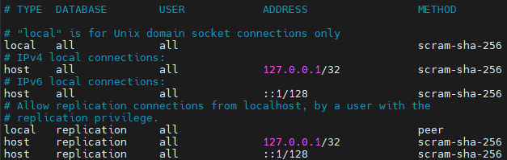
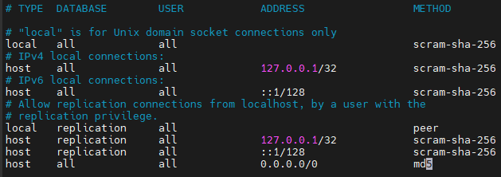
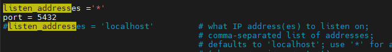
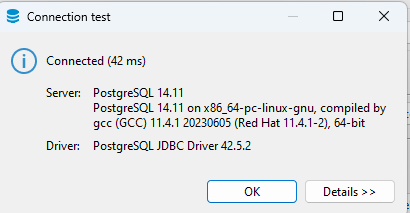

# PostgreSQL란?
- ORDBMS(객체 관계형 데이터베이스 관리 시스템) 으로 DB 객체를 손쉽게 관리 할 수 있게 도와준다.
- 무료 오픈소스 소프트웨어이다.

## 1. PostgreSQL 설치
1. ### PostgreSQL 설치가 가능한 버전 확인
    ```
    # sudo yum module list postgresql
    ```

 2. ### 레포지토리 추가

    ```
    # wget https://download.postgresql.org/pub/repos/yum/common/redhat/rhel-8.9-x86_64/pgdg-redhat-repo-42.0-38PGDG.noarch.rpm

    # yum localinstall pgdg-redhat-repo-42.0-38PGDG.noarch.rpm
    ```
    - 레포지토리는 일반 시스템 및 패치 관리를 지원해주며 PostgreSQL 버전에 자동 업데이트를 지원해준다.

3. ### PostgreSQL14 설치
    ```
    # sudo yum install postgresql14 postgresql14-server -y
    ```

- 위 단계를 따르면 postgreSQL14 가 설치된다.

## 2. 외부 접속을 위한 DB 설정
1. ### DB 초기화
    ```
    # sudo /usr/pgsql-14/bin/postgresql-14-setup initdb
    ```

2. ### DB 시작 및 기동 시 시작 설정 
    ```
    # systemctl start postgresql-14
    
    # systemctl enable postgresql-14

    # su - postgres 

    # systemctl stop postgresql-14
    ```
    - postgres 계정으로 접근이 가능한지 확인하기 위해 마지막 명령어를 입력 
    - 이후 다시 DB를 종료하자


3. ### 패스워드 초기화
    - pg_hba.conf를 수정 해 주기위해 find 로 찾는다.
        ```
        # find / -name pg_hba.conf
        
        # cd [pg_hba.conf 경로]

        # vi pg_hba.conf
        ```
        

    - 이후 pg_hba.conf를 아래와 같이 수정해준다.
        ```
        # vi pg_hba.conf
        ```
        

    - local과 host 의 METHOD를 trust로 변경해준다.

    - 변경해준 후 다시 DB를 실행하고난 뒤 패스워드를 변경해주자.
        ```
        # systemctl start postgresql-14

        # su - postgres

        # psql

        # alter user postgres with password '원하는 패스워드';
        ```
        

    - 변경해준 후 다시 pg_hba.conf를 원복해주자.
        ```
        # cd [pg_hba.conf 경로]

        # vi pg_hba.conf
        ```

        

    - 이후 DB를 재실행 해 주면 된다.

4. ### DB 외부 접속 설정
    - pg_hba.conf에 외부 설정을 해준다.
        ```
        # cd [pg_hba.conf 경로]

        # vi pg_hba.conf
        ```
    - host all all 0.0.0.0/0 md5 를 추가 해 주면 된다.

        

    - pg_hba.conf가 있는 경로에서 postgresql.conf도 변경 해 준다.
        ```
        # cd [pg_hba.conf 경로]

        # vi postgresql.conf
        ```

    - 이후 아래처럼 수정해 준다.
        ```
        listen_addresses ='*'
        
        port = 5432
        ```
        

    - 그러고 방화벽을 열고 DB를 재실행하면 외부접속이 된다.
        ```
        # firewall-cmd --permanent --add-port=5432/tcp
        
        # firewall-cmd --reload
        ```
        
        

## 3. PostgreSQL 라이브러리
1. ### PostGIS 설치
    - 설치 가능한 PostGI를 우선 확인한다.

        ```
        # yum list postgis*
        ``` 

    - EPEL 레포지토리를 설치한다.
        ```
        # yum install epel-release
        ```

    - 자신의 PostgreSQL 버전에 맞는 PostGIS 를 설치한다.
    - 본인은 14버전임으로 postgisXX_14 를 설치했다
        ```
        # yum install postgis32_14 
        ```

    - 만약 설치할 때 <b>"from pgdg14 requires gdal38-libs >= 3.8.4, but none of the providers can be installed" </b>이란 에러가 발생시 아래 명령어로 CRB 저장소를 활성화하자

        ```
        # dnf config-manager --enable crb
        ```

