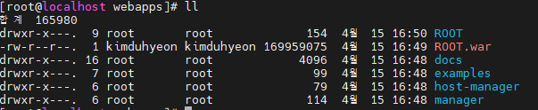

# War 파일이란?
- WAR는 WebApplication Archive의 약자로 웹 어플리케이션 저장소이자, 웹 어플리케이션을 압추해 저장해놓은 파일이다

## 1. Tomcat War 배포
1. ### war파일 webapps로 이동
    ```
    # mv [파일명].war /[톰캣경로]/webapps
    ```
2. ### war파일명 변경
    - ROOT.war 로 변경해준다.
    
        

3. ### Tomcat 재시작
    - tomcat을 재시작 한다.