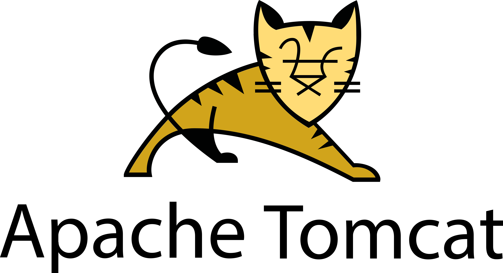

# Tomcat이란?
- Apache 재단에서 만든 소프트웨어
- 동적 데이터를 처리하는 웹서버
    - 동적 처리를 담당하는 서버를 WAS(Web Application Server)라 한다.
    - Tomcat도 WAS
- 웹 서버 <-> 웹 컨테이너 간 다양한 기능과 역할을 수행
## 1. Tomcat 설치
1. 자바 버전이 있는지 확인
    ```
    # java -version
    ```

2. 자바가 없다면 자바 설치
    ```
    # yum search openjdk*

    # yum install -y  java-1.8.0-openjdk.x86_64
    ```

3. Tomcat 다운로드
    ```
    # wget https://downloads.apache.org/tomcat/tomcat-9/v9.0.85/bin/apache-tomcat-9.0.85.tar.gz
    ```

4. 톰캣 압축 해제
    ```
    # tar xvzf apache-tomcat-9.0.85.tar.gz
    ```

5. 톰캣 이름 임의 변경
    ```
    # mv apache-tomcat-9.0.85 tomcat-test
    # mv tomcat-test /home/
    ```