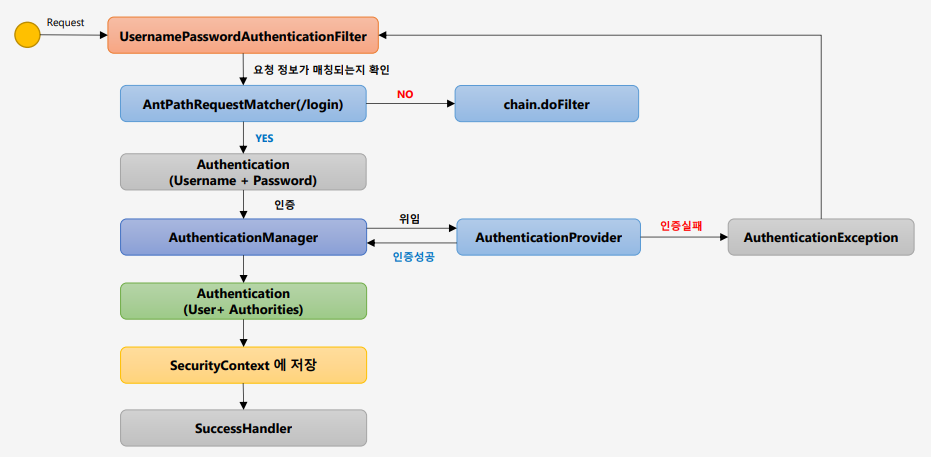

# Spring Security란?
- Spring Security는 Spring 기반의 보안 Framework이다.
- 보안 관련 기능을 구현 가능하게 한다.
- 인증, 인가를 처리하는 역할을 한다.

### 인증(Authentication) 
    - 신원을 검증
    - 인증 프로세스로 인증이 성공되면 시스템 엑세스가 가능

### 인가(Authorization)
    - 인증된 사용자가 요청한 자원에 접근 가능한지를 결정
    - 인증 성공 후 인가 절차가 이루어짐

## 1. WebSecurityConfigurerAdapter 설정
- 스프링 시큐리티의 웹 보안 기능의 초기화 및 설정을 도와준다.
- WebSecurityConfigurerAdapter를 상속받아 HttpSecurity 클래스를 사용한다.

## 2. FormLogin
- 스프링 시큐리티의 HttpSecurity 클래스의 formLogin을 이용해 인증 API를 도와준다.
- FormLogin의 <b>UsernamePasswordAuthenticationFilter</b>를 사용하여 인증처리를 한다.
    - AntPathRequestMatcher : 요청 정보와 매칭되는지 확인 
    - Authentication : 인증객체를 만들어 AuthenticationManager에게 전달하거나 인증된 객체를 받음
    - AuthenticationManager : 객체를 Authentication에게 받아 인증 처리를 Provider에 위임함
    - AuthenticationProvider : 인증 처리를 담당함
    - AuthenticationException : 인증 실패를 처리하여 예외처리함
    - SecurityContext : 인증된 객체를 저장함
    - SuccessHandler : 인증성공을 처리함

    

## 3. Logout
- Post 방식으로 로그아웃을 요청한다.
    - LogoutFilter : 로그아웃 요청을 처리해준다.
    - AntPathRequestMatcher : 로그아웃 url인지 검증해 준다
    - chain.doFilter : 로그아웃 url이 아니라면 로그아웃 처리를 하지 않고 다음 필터로 넘어간다
    - Authentication : <b>SecurityContext</b> 에서 사용자 객체를 가져옴
    - SecurityContext : 인증된 사용자의 객체가 담겨져있음
    - SecurityContextLogoutHandler : 세션 무효화, 쿠키 삭제 등을 처리한다.
    
    

## 4. 